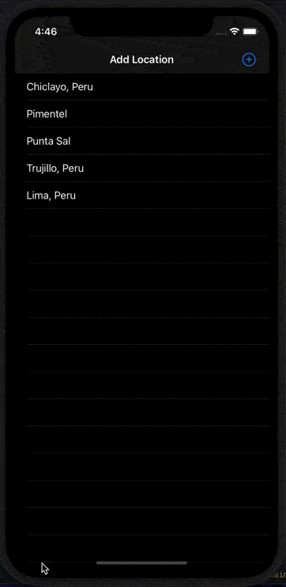

# Weather App

Final Project of the [iOS Developer Nanodegree course](https://www.udacity.com/course/ios-developer-nanodegree--nd003).

## Getting Started

Download the project from [Github](https://github.com/RicardoBravoA/WeatherApp), the updated branch is **main**

## Basic Requirements

- Xcode 12.5.1
- iOS 14.5
- For [API Key](https://openweathermap.org/) and replace in ./Data/Api/ -> EndPoint.swift -> appID

## Project Instructions

The project has this features.

    

- Add Location
    - Press the button + and write any location.
    - List all locations with CoreData.
    - Remove location with swipe to delete.
- Search Location
    - Search any location.
    - Save selected location in CoreData    
- Detail
    - Download weather data from Open Weather Map API.

## License

    Copyright 2021 Ricardo Bravo (Woz).

    Licensed under the Apache License, Version 2.0 (the "License");
    you may not use this file except in compliance with the License.
    You may obtain a copy of the License at

       http://www.apache.org/licenses/LICENSE-2.0

    Unless required by applicable law or agreed to in writing, software
    distributed under the License is distributed on an "AS IS" BASIS,
    WITHOUT WARRANTIES OR CONDITIONS OF ANY KIND, either express or implied.
    See the License for the specific language governing permissions and
    limitations under the License.